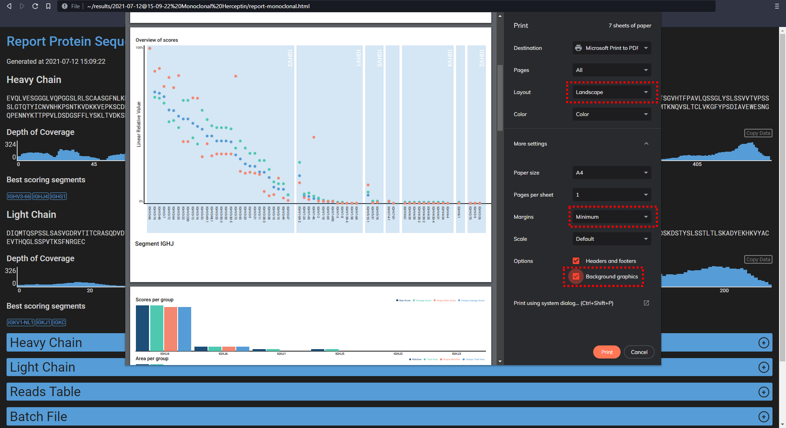

---
geometry:
- margin=2.5cm
hyperrefoptions:
- linktoc=all
- pdfwindowui
documentclass: report
---

# Assembler Batch Files Manual

## Introduction

Batch files are used to aggregate all information for one run of the program. These files can be edited with any plain text editor. There is no specific extension required by the program so `.txt` is recommended because these will automatically be opened by an editor in plain text.

The full code for the program can be found here: [https://github.com/snijderlab/stitch](https://github.com/snijderlab/stitch).

## VS Code plugin (unstable)

In the [repository](https://github.com/snijderlab/stitch) there is a folder called `stitch-vscode-extension` by copying this to your VS Code extension folder (`user/.vscode/extensions`) the extension is installed. By then setting the format of an opened batch file to 'Protein Assembler', by clicking on the format name (normally 'Plain Text' for .txt files), colours will be shown to aid in the overview of the files. This extension is very simple so it does not do any error checking, but it should still be useful.

## Structure

The general structure is parameters followed by values. A parameter is the first thing on a line (possibly preceded by whitespace) followed by a delimiter ( `:` for single valued parameters, `:>`/`<:` for multiline single valued parameters or `->`/`<-` for multiple valued parameters) (possibly followed by whitespace) followed by the value(s). Parameter names and most values are not case specific.

In any place where a single valued parameter is expected both a single line `:` and a multiline `:>`/`<:` are valid. 

Lines starting with a hyphen `-` are considered comments and disregarded. Comments can be placed in the outer scope and in multiple valued arguments.

The parameters are organised in multiple scopes each having a specified set of parameters determining the behaviour of a specified step in the assembly process. Following is an overview of the general structure.

```
-Outer Scope, can contain Run Info parameters

Input ->
    -Determines the input files to be used
    -Can only be specified once
<-

Template Matching ->
    -Has parameters defining the segment matching step
    -Like scoring, alphabet and the segments itself
    -Can only be specified once
<-

Recombine ->
    -Has parameters defining the behaviour of the recombination step
    -Aligns the segments from TemplateMatching with the paths from the assembler
    -Can only be specified once
    -Template Matching has to be specified for recombination te be specified
<-

Report ->
    -Has parameters defining the output of the assembler
    -Can only be specified once
    -Has to be specified
<-
```

### All parameters

Here is a list of all parameters and their possible values. An `s` after the name indicates it is a single valued parameter, an `m` indicates it is a multiple valued parameter. A star `*` after the name indicates that the scope or parameter can be specified multiple times.

All paths are specified from the directory of the batch file.

All assets are loaded from the folder `assets` in the folder of the binary.

#### The full list of all parameters

* Run Info
    * Version
    * Runname
    * MaxCores
* Input
    * Reads
    * FASTA
    * Peaks
    * mmCIF
    * MaxNovo
    * Novor
    * Casanovo
    * pNovo
    * Folder
* Template Matching
    * CutoffScore
    * Alphabet
    * EnforceUnique
    * ForceGermlineIsoleucine
    * Segments (possibly grouped)
        * Segment
            * Name
            * Path
            * CutoffScore
            * Alphabet
            * Identifier
            * ClassChars
            * ForceGermlineIsoleucine
* Recombine
    * N
    * Order
    * CutoffScore
    * Alphabet
    * EnforceUnique
    * ForceGermlineIsoleucine
    * Decoy
* Report
    * HTML
    * FASTA
    * CSV

Recurring definitions:

* Alphabet
    * Path
    * Data
    * Name
    * GapStartPenalty
    * GapExtendPenalty


#### Run Info

These parameters are placed in the outer scope. So not nested in any other parameter. These parameters dictate general settings for the whole run.

##### Version (s)

The version of the batch file. This parameter is required. Major versions will not be backwards compatible, so 2.0 will not work with Stitch designed for 1.0. Minor versions will be backwards compatible, so for example 1.2 will work with Stitch designed for 1.0.

_Example_
```
Version: 1.1
```

##### Runname (s)

The name of the run, to keep it organized. This name can consist of any characters except newlines. If the name is not provided it will default to the name of the batchfile without the extension, eg `basic` if the filename is `basic.txt`.

_Examples_
```
Runname: MyFirstTestRun
Runname: Monoclonal Antibodies From Rabbits
```

##### MaxCores (s)

The maximum amount of cores to be used by this run. Default is the amount of cores of the machine.

_Examples_
```
MaxCores: 4
MaxCores: 86
```

##### RawDataDirectory (s) (deprecated)
***Deprecated, use the RawFileDirectory with each separate input definition.***

The path to the directory that contains all raw data files. This should be the directory in which the files that are listed in the Peaks input files are located. If  any one particular file, or a particular scan could not be found this will be ignored and the output report will just not contain that spectrum. If the full directory could not be located there will be a warning, but the reports will still be generated. For now only Thermo raw files are supported. More information can be found in the library used for opening the raw files 'Hecklib.core' and 'Hecklib.rawfiles'.

_Example_
```
RawDataDirectory: R:/RawData/08-2022/
```

#### Input

This scope contains parameters to load reads.

##### Reads (m) * 

A multiple valued parameter containing a Path, to a file with reads, and a Name, for this file to aid in recognizing where the data comes from.

| Inner parameter | Explanation                                          | Default Value |
| --------------- | ---------------------------------------------------- | ------------- |
| Path            | The path to the file                                 | (No Default)  |
| Name            | Used to recognize the origin of reads from this file | (No Default)  |

_Example_
```
Reads ->
    Path: Path/To/My/FileWithReads.txt
    Name: NameForMyFile
<-
```

_Example Reads file_
```
# Comments can be added with pound signs
DYEKHKVYAC
SGFGGLKNTYLHW
``` 

##### FASTA (m) *

A multiple valued parameter containing a Path, to a fasta file with reads, and a Name, for this file to aid in recognizing where the data comes from.

| Inner parameter | Explanation                                                                                       | Default Value |
| --------------- | ------------------------------------------------------------------------------------------------- | ------------- |
| Path            | The path to the file.                                                                             | (No Default)  |
| Name            | Used to recognize the origin of reads from this file.                                             | (No Default)  |
| Identifier      | A Regex to get the identifier from the fasta header line, the first group will be used as the id. | (.*)          |

_Example_
```
FASTAInput ->
    Path: Path/To/My/FileWithReads.fasta
    Name: NameForMyFile
<-
```

_Example Fasta file_
```
> read_00
DYEKHKVYAC
> read_01
SGFGGLKNTYLHW
```
###### Annotated Fasta files (mainly for templates)

The fasta file can contain annotated sequences. Sequences are annotated by a set of parentheses with the class/annotation followed by a space followed by the sequence, see example below. These annotations are shown in the Annotated Consensus Sequence in the HTML detail pages for templates. Currently these annotations are supported: CDR, Conserved, Glycosylationsite. Annotated files for the common organisms and segments are included. For other segments these annotated files can be generated by downloading the following webpage (http://www.imgt.org/IMGTrepertoire/Proteins/) where one of the domain can be chosen and on the following webpage the species can be chosen. An example is (http://www.imgt.org/IMGTrepertoire/Proteins/proteinDisplays.php?species=human&latin=Homo%20sapiens&group=IGHJ). This file can then be fed into the program using the "annotate" command to generate the annotated Fasta files from the HTML file, see example below.

_Example of annotated Fasta file, Homo sapiens IGHJ_
```
>IGHJ1
(CDR AEYFQH)(Conserved WG)Q(Conserved G)TLVTVSS
>IGHJ2
(CDR YWYFDL)(Conserved WG)R(Conserved G)TLVTVSS
>IGHJ3
(CDR DAFDV)(Conserved WG)Q(Conserved G)TMVTVSS
>IGHJ4
(CDR YFDY)(Conserved WG)Q(Conserved G)TLVTVSS
>IGHJ5
(CDR NWFDS)(Conserved WG)Q(Conserved G)TLVTVSS
>IGHJ6
(CDR YYYYYGMDV)(Conserved WG)Q(Conserved G)TTVTVSS
```

_Example of generating an annotated file from a downloaded HTML page_
```
>assembler.exe annotate ".\templates\IMGT Repertoire Homo sapiens IGHJ.html" .\templates\Homo_sapiens_IGHJ_annotated.fasta
```

##### Peaks (m) *

A multiple valued parameter to input data from a Peaks export file (.csv).

From this file the reads that score high enough are included (>=`CutoffALC`). As are smaller patches within reads of which all positions score high enough (>=`LocalALC`).

Any parameter with a default value can be left out.

| Inner parameter  | Explanation         | Default Value |
| ---------------- | ------------------- | ------------- |
| Path             | The path to the file                                                      | (No Default)  |
| CutoffALC        | The score a reads must at least have to be included in the list of reads  | 90            |
| LocalCutoffALC   | The score a patch in a read should at least have to be included.          | (not used)    |
| MinLengthPatch   | The minimal length of a patch before it is included.                      | (not used)    |
| Format           | The format of the Peaks export, this depends on the version of Peaks, now only has the options `Old`, `X` and `X+`. If any gives errors in reading the file maybe another one will work. | `X+`          |
| Name             | Used to recognize the origin of reads from this file                      | (No Default)  |
| Separator        | The separator used to separate cells in the csv                           | `,`           |
| DecimalSeparator | The separator used to separate decimals                                   | `.`           |
| RawDataDirectory | The directory to load raw data from (see below for more info).            | (No Default)  |
| XleDisambiguation | Set to `True` to use the side chain fragments (w and d) to disambiguate Leucines and Isoleucines (see below for more information).        | `False`  |

_Examples_
```
-Minimal definition
Peaks ->
    Path: Path/To/My/FileWithPeaksReads.csv
    Name: NameForMyFile
<-

-Maximal definition
Peaks           ->
    Path            : Path/To/My/FileWithPeaksReads.csv
    Name            : NameForMyFile
    CutoffALC       : 98
    LocalCutoffALC  : 85
    Format          : Old
    MinLengthPatch  : 5
    Separator       : ;
    DecimalSeparator: ,
<-
```

_Example Peaks file version X+_
```
Fraction,Source File,Feature,Peptide,Scan,Tag Length,Denovo Score,ALC (%),length,m/z,z,RT,Predict RT,Area,Mass,ppm,PTM,local confidence (%),tag (>=0%),mode
10,20191211_F1_Ag5_peng0013_SA_her_Asp_N.raw,F10:3434,DYEKHKVYAC(+58.01),F10:3629,10,99,99,10,438.5332,3,19.91,-,2.3176E6,1312.5757,1.6,Carboxymethyl,100 100 100 100 100 100 100 100 100 100,DYEKHKVYAC(+58.01),ETHCD
4,20191211_F1_Ag5_peng0013_SA_her_Ela.raw,F4:4797,SGFGGLKN(+.98)TYLHW,F4:9505,13,99,99,13,494.2459,3,52.43,-,2.4924E7,1479.7146,0.9,Deamidation (NQ),100 100 100 100 100 100 100 100 100 100 100 100 100,SGFGGLKN(+.98)TYLHW,HCD
```

_Example Peaks file version X_
```
Fraction,Source File,Feature,Peptide,Scan,Tag Length,ALC (%),length,m/z,z,RT,Area,Mass,ppm,PTM,local confidence (%),tag (>=0%),mode
10,20191211_F1_Ag5_peng0013_SA_her_Asp_N.raw,F10:3434,DYEKHKVYAC(+58.01),F10:3629,10,99,10,438.5332,3,19.91,2.3176E6,1312.5757,1.6,Carboxymethyl,100 100 100 100 100 100 100 100 100 100,DYEKHKVYAC(+58.01),ETHCD
4,20191211_F1_Ag5_peng0013_SA_her_Ela.raw,F4:4797,SGFGGLKN(+.98)TYLHW,F4:9505,13,99,13,494.2459,3,52.43,2.4924E7,1479.7146,0.9,Deamidation (NQ),100 100 100 100 100 100 100 100 100 100 100 100 100,SGFGGLKN(+.98)TYLHW,HCD
```
_Note: this does not contain the `Predict RT` and `Denovo Score` columns from Peaks X+_

_Example Peaks file version Old_
```
Scan,Peptide,Tag Length,ALC (%),length,m/z,z,RT,Area,Mass,ppm,PTM,local confidence (%),tag (>=0%),mode
10,20191211_F1_Ag5_peng0013_SA_her_Asp_N.raw,F10:3434,DYEKHKVYAC(+58.01),F10:3629,10,99,10,438.5332,3,19.91,2.3176E6,1312.5757,1.6,Carboxymethyl,100 100 100 100 100 100 100 100 100 100,DYEKHKVYAC(+58.01),ETHCD
4,20191211_F1_Ag5_peng0013_SA_her_Ela.raw,F4:4797,SGFGGLKN(+.98)TYLHW,F4:9505,13,99,13,494.2459,3,52.43,2.4924E7,1479.7146,0.9,Deamidation (NQ),100 100 100 100 100 100 100 100 100 100 100 100 100,SGFGGLKN(+.98)TYLHW,HCD
```
_Note: this does not contain the `Fraction`, `Source File`, and `Feature` columns from Peaks X_

###### RawDataDirectory (s)

The path to the directory that contains all raw data files. This should be the directory in which the files that are listed in the Peaks input files are located. If any one particular file, or a particular scan could not be found this will be ignored and the output report will just not contain that spectrum. If the full directory could not be located there will be a warning, but the reports will still be generated. For now only Thermo raw files and mgf are supported. More information can be found in the library used for opening the raw files 'Hecklib.core' and 'Hecklib.rawfiles'.

_Example_
```
RawDataDirectory: R:/RawData/08-2022/
```

###### XleDisambiguation (s)

If set to `True` the program will before running the template matching go through all reads and determine based on side chain fragmentation (w and d ions) if a Leucine or Isoleucine is better supported. If no support (or equal support) is found it will insert a `J` at that location, to be able to use this later as a direct marker for ambiguity. To prevent false discoveries make sure w and d ions are expected with your MS method.

##### Novor (m) *

A multiple valued parameter containing one or both different Novor output files and a Name, for this set to aid in recognizing where the data comes from. Either the DeNovo or PSMS files can be used on their own, but they can also be specified together to group the data together. A cutoff can be given to use all reads with a score equal or higher (`read.score >= cutoff`). As the score ranges from 0 to 100 inclusive the cutoff can only be specified within this range. The default value is `0` which includes all reads.

| Inner parameter | Explanation                                               | Default Value |
| --------------- | --------------------------------------------------------- | ------------- |
| DeNovo Path     | The path to the Novor `denovo.csv` file                   | (No Default)  |
| PSMS Path       | The path to the Novor `psms.csv` file                     | (No Default)  |
| Name            | Used to recognize the origin of reads from this file.     | (No Default)  |
| Separator       | The separator used to separate fields.                    | ,             |
| Cutoff          | The score cutoff for inclusion in the used reads. \[0..100\] | 0             |

_Example_
```
Novor ->
    DeNovo Path: Path/To/My/FileWithReads.csv
    Name: NameForMyFile
<-
```

##### MMCIF (m) *

Used to load mmCIF files from ModelAngelo, it assumes the basic structural information is in place as is the local confidence saved in the B factor ranged 0-100. When using reads from other sources than MS make sure to check that the scoring matrix used is suitable for the technique you are using. 

| Inner parameter | Explanation                                               | Default Value |
| --------------- | --------------------------------------------------------- | ------------- |
| Path     | The path to the file.                   | (No Default)  |
| Name            | Used to recognize the origin of reads from this file.     | (No Default)  |
| MinLength       | The minimal length of a chain to be included as read (inclusive).                    | 5             |
| CutoffALC          | The average local confidence cutoff for inclusion in the used reads. \[0..100\] | 0             |

_Example_
```
MMCIF ->
    Path: Path/To/My/File.cif
    Name: NameForMyFile
<-
```

##### MaxNovo (m) *

Used to load `msmsScan.txt` files from MaxNovo.

| Inner parameter | Explanation                                               | Default Value |
| --------------- | --------------------------------------------------------- | ------------- |
| Path        | The path to the file.                                       | (No Default)  |
| Name        | Used to recognize the origin of reads from this file.       | (No Default)  |
| CutoffScore | The score cutoff for inclusion in the used reads. \[0..100\] | 10             |
| RawDataDirectory | The directory with all raw files, assumes they have the same name as present in the file.      | (No Default)  |
| XleDisambiguation | Set to `True` to use the side chain fragments (w and d) to disambiguate Leucines and Isoleucines (see below for more information).        | `False`  |
| FixedModification | The fixed modifications presented as aminoacid followed by the shift separated by commas, eg `C+58.00548,M+15.99491` | (No Default) |

##### Casanovo (m) *

Used to load mzTab files from Casanovo.

| Inner parameter | Explanation                                               | Default Value |
| --------------- | --------------------------------------------------------- | ------------- |
| Path        | The path to the file.                                       | (No Default)  |
| Name        | Used to recognize the origin of reads from this file.       | (No Default)  |
| CutoffScore | The score cutoff for inclusion in the used reads. \[-1..1\] | 0             |
| FilterPPM   | The maximal ppm error (Abs(mz_exp - mz_the) / mz_the * 1e6) for inclusion in the used reads (inclusive). \[0..\]      | (No Default)  |
| RawDataDirectory | The directory with all raw files, assumes they have the same name as present in the Casanovo mzTab file.      | (No Default)  |
| XleDisambiguation | Set to `True` to use the side chain fragments (w and d) to disambiguate Leucines and Isoleucines (see below for more information).        | `False`  |
| FragmentationMethod | The used fragmentation method, as mgf data does not store this information in a standardised way. | `All` |

##### pNovo (m) *

Used to load `result.res` files from pNovo.

| Inner parameter | Explanation                                               | Default Value |
| --------------- | --------------------------------------------------------- | ------------- |
| Path        | The path to the `result.res` file.                            | (No Default)  |
| Param       | The path to the `pNovo.param` file.                           | (No Default)  |
| Name        | Used to recognize the origin of reads from this file.         | (No Default)  |
| CutoffScore | The score cutoff for inclusion in the used reads. \[0..100\]  | 9             |
| RawDataDirectory | The directory with all raw (thermo raw, not mgf) files, assuming the first column of the .res file contains the following format `<name>.<scan>.<scan>.<charge> File:"<name>.raw", NativeID:"...`.      | (No Default)  |
| XleDisambiguation | Set to `True` to use the side chain fragments (w and d) to disambiguate Leucines and Isoleucines (see below for more information).        | `False`  |
| FragmentationMethod | The used fragmentation method, as mgf data does not store this information in a standardised way. | `All` |

##### Folder (m) *

Open a specified folder and open all reads files in it. Files with `.txt` as extension will be read as Reads. Files with `.fasta` as extension will be read as Fasta. Files with `.csv` as extension will be read as Peaks. It is possible to provide a filter for the files in the form of a constant text the files have to start with.

So in the example below (example 01) all `.txt`, `.fasta` and `.csv` files in the dictionary starting with the text `reads-IgG` will be opened.

For Peaks files extra parameters can be attached. All properties used in a peaks definition can also be used in a folder definition, with the caveat that here they should be prefixed with `Peaks`. As can be seen in example 02. The same holds for the extra parameter for Fasta files, the parameter `Identifier` can be used to provide the identifier for the fasta reads.

The folder can be opened recursively using `Recursive: True` which has a default value of `False`. This will go through all folders inside of the specified folder, and all folders in these recursively.

```
- Example 01
Folder ->
    Path: ../systematictest/reads
    StartsWith: reads-IgG
<-

- Example 02
Folder ->
    Path       : ../systematictest/reads
    PeaksFormat: Old
    StartsWith : Herceptin
    Recursive  : True
<-
```

#### TemplateMatching (m)

To determine the parameters for template matching. Can only be specified once. Often used with the reference set from IMGT (http://www.imgt.org/vquest/refseqh.html).

##### CutoffScore (s)

The mean score per position needed for a path to be included in the Segment score. Default value: 10.

##### Alphabet (m)

Determines the alphabet to use. See the scope Alphabet for more information about its definition.

##### EnforceUnique (s)

Determines of the paths/reads of this segment will be forced to the best template(s) or just all templates which score high enough. If your batchfiles contains multiple segments or segment groups the best placement for the read across all of these templates is forced. Setting this options for TemplateMatching sets the default value for use in Recombine. Possible values: `True` and `False`. Default: `True`.

##### ForceGermlineIsoleucine (s)

With this option on the program will force an Isoleucine (I) if the consensus sequence has a Leucine (L) as highest scoring amino acid and the template (germline for antibodies) contains an Isoleucine at that position. Setting this options for TemplateMatching overrules the value set in Recombine. Possible values: `True` and `False`. Default: `True`.

##### BuildTree (s)

With this option on the program will generate a very basic phylogenetic tree of the provided templates within each segment. Possible values: `True` and `False`. Default: `True`.

##### Segments (m)

Defines a list of segments to match against. A single segment is defined by the parameter `Segment` which can be defined multiple times within `Segments`. Segments will be read based on their extension `.txt` will be read as Simple, `.fasta` as Fasta and `.csv` as Peaks. For Peaks extra parameters can be attached. All properties used in a peaks definition can also be used in this definition, with the caveat that here they should be prefixed with `Peaks`.

`CutoffScore`, `Alphabet`, `EnforceUnique`, and `Scoring` can be defined to overrule the definition of the respective parameter in Template Matching.

Only when using recombination the properties `Identifier` and `ClassChars` are useful. The `Identifier` property takes a regex to parse the identifier from the full fasta header. The `ClassChars` property takes a number signifying the amount of chars that make up the name of the class (eg IgG1/IgG2/etc), these characters will be taken from the start of the identifier. When no `ClassChars` is present there will be no differentiation between classes in the results page.

The segments can be grouped into segment groups. These will be presented separately in the output HTML report. This is extremely useful for example to separate the Heavy and Light chain of an antibody.

_Example_
```
Segments ->
    Segment ->
        Path    : ../templates/smallIGHV.fasta
        Name    : IGHV Human
        CutoffScore : 0.75
        Alphabet ->
            Path	: ../alphabets/blosum62.csv
            Name	: Blosum62
        <-
    <-

    Segment ->
        Path        : ../templates/smallIGHV.csv
        PeaksFormat : Old
        Name        : IGHV Human
        CutoffScore : 4
        Alphabet ->
            Path	: ../alphabets/blosum62.csv
            Name	: Blosum62
        <-
    <-
<-

- Or with groups
Segments ->
    Heavy Chain ->
        Segment ->
            Path    : ../templates/smallIGHV.fasta
            Name    : IGHV Human
        <-
        - Any number of other segments can be defined here, but logically IGHJ and IGHC will follow
    <-
    Light Chain ->
        - All light chain segments can be defined here
    <-
<-
```
###### Name (s) 

The name of this segment, will be used to make the report more descriptive.

###### Path (s)

The templates to be used in this segment. Uses the same logic as Input->Folder to load the file. So uses the extension to determine the right file format. And like Folder extra parameters can be supplied to have finer control over the loading of the files. Like 'Identifier, for Fasta files and all Peaks parameters with the prefix `peaks`.

###### CutoffScore (s)

The mean score per position needed for a path to be included in the Segment score. Default value: 0.

###### AmbiguityThreshold (s)

The threshold which determines if a position is seen as ambiguous for the ambiguity overview analysis. Expressed as a fraction. Default value: 0.75.

###### Alphabet (m)

Determines the alphabet to use. See the scope Alphabet for more information about its definition.

###### Identifier (s) 

Specifies a Regular Expression to parse the identifier from the Fasta header of the templates. The default value is `(.*)`, the first capturing group will be used as the identifier. The second capturing group (if available) will be used as the class name of the template.

###### Scoring (s)

The scoring strategy used when determining the score of this segment. `Absolute` will just add the scores of all individual templates. `Relative` will divide the scores for individual templates by their respective length, giving lengthwise very different templates a fairer chance of being chosen for recombination. Default: `Absolute`.

###### EnforceUnique (s)

Determines of the paths/reads of this segment will be forced to the best template(s) or just all templates which score high enough. The cutoff is specified in terms of the fraction of the highest scoring placement, so `0.95` will make all placements that score at least `0.95` times the highest placement be placed. If there is only one read that will be placed this placement is noted as unique. Possible values: a number between `0.0` and `1.0` or `True` (`1.0`) or `False` (`0.0`). Default is `1.0`.

##### ForceGermlineIsoleucine (s)

With this option on the program will force an Isoleucine (I) if the consensus sequence has a Leucine (L) as highest scoring amino acid and the template (germline for antibodies) contains an Isoleucine at that position. Possible values: `True` and `False`. Default is the value in TemplateMatching which defaults to `True`.


###### GapHead (s)

Adds 20 gaps (`X`) at the front of all templates in this segment. This can be used to extend the segments for example to recover the sequence of CDRs. This property can also be used on a single template. This will automatically be set to `True` when a gap is placed before this segment in the Recombination order. Default: `False`.

###### GapTail (s)

Adds 20 gaps (`X`) at the end of all templates in this segment. This can be used to extend the segments for example to recover the sequence of CDRs. This property can also be used on a single template. This will automatically be set to `True` when a gap is placed after this segment in the Recombination order. Default: `False`.

#### Recombine

Defines how to recombine the ed segments, as such TemplateMatching has to be defined to be able to define Recombine. Recombination can be used to pick the _n_ highest scoring templates out of each segment, these will be recombined in the order provided. These recombined templates are then aligned with all paths. This should provide the opportunity to detect the placement of paths relative to each other. It also provides insight into the most likely template in the segment the input matches with. Be warned, the runtime factorially increases with _n_.

_Example_
```
Recombine->
    n : 1
    CutoffScore : 2.6
    Order : IGHV * IGHJ IGHC
<-
```

##### N (s)

The amount of templates to recombine from each segment. From every segment it will take the top N templates and join all of them together in all possible configurations, this means that the number of recombined templates factorially increases with N. Default is 1.

##### Order (s)

The order in which the segments will be recombined. Defined as a list of the names of the segment in order possibly with gaps (`*`) in between. The names are separated by whitespace or the gap character (`*`).

_Example_
```
Order: IGHV IGHJ * IGHC
```

If there are multiple segment groups defined the order should be defined separately for each group. The names are matches to the segment group names disregarding casing.

_Example_
```
Order -> 
    Heavy Chain: IGHV IGHJ * IGHC
    Light Chain: IGLV IGLJ IGLC
<-
```

A gap (`*`) indicates that there should be more sequence in between the segments but that no appropriate template is available, this for example is the case in the CDR3 region. To find the correct sequence in this case the program will try to find back the sequence. This is done by expanding both surrounding segments with Xs which allows the template matching step to add all heads/tails of matched reads to the consensus sequence of that template. On recombination the consensus sequences are compared to find the overlap. If the template matching was successful and the input data was of high enough quality both templates will have the full sequence of the missing region, which can be combined into the correct template for recombination. If there is no overlap found, so no reads where matched on the Xs, or not enough to find the whole sequence a gap will be placed between the two consensus sequences. This signals to the users that some part of the sequence could be missing and leaves the opportunity to match reads with the full sequence to this gap in recombination.

##### CutoffScore (s)

The mean score per position needed for a path to be included in the Segment score. Default value: 10.

##### Alphabet (m)

Determines the alphabet to use. Defaults to the alphabet defined in Template Matching. See the scope Alphabet for more information about its definition.

##### EnforceUnique (s)

Determines of the paths/reads of this segment will be forced to the best template(s) or just all templates which score high enough. The cutoff is specified in terms of the fraction of the highest scoring placement, so `0.95` will make all placements that score at least `0.95` times the highest placement be placed. If there is only one read that will be placed this placement is noted as unique. Possible values: a number between `0.0` and `1.0` or `True` (`1.0`) or `False` (`0.0`), but the use of booleans is deprecated. Default is the value in TemplateMatching which defaults to `1.0`.

##### ForceGermlineIsoleucine (s)

With this option on the program will force an Isoleucine (I) if the consensus sequence has a Leucine (L) as highest scoring amino acid and the template (germline for antibodies) contains an Isoleucine at that position. Possible values: `True` and `False`. Default is the value in TemplateMatching which defaults to `True`.

##### Decoy (s)

Create a decoy set from all templates that were not used in the recombination. This decoy set will catch reads that do not match the recombined templates well, which would otherwise be placed there. This setting is especially useful if you have a dataset with lots of background. If `EnforceUnique` is turned off all reads will be matched to all templates, so this setting will be ineffective. Possible values: `True` and `False`. Default: `True`.

#### Report

##### Folder (s)

You can specify a base folder where all report files will be saved. If this folder is not specified it defaults to the folder of the batchfile.

_Example_
```
Report ->
    Folder: ../results/{datetime} {name}/
    HTML ->
        Path: report.html
    <-
    CSV ->
        Path         : aligned-reads.csv
        OutputType   : Recombine
    <-
<-
```

##### HTML (m) *

To generate an HTML report. This report displays all information about this run, including all original metadata of the input. The report is designed to be used interactively to aid in understanding how well the software performed and how trustworthy the results are. The report will be generated as an overview file (with the name specified) with a folder with all additional details (with the same name as the HTML file). 

| Inner parameter | Explanation                                                                                                     | Default Value |
| --------------- | --------------------------------------------------------------------------------------------------------------- | ------------- |
| Path            | The path to save the report to, this path can be made dynamically (see '[Generating Names](#generating-names)') | (No Default)  |

_Example_
```
Report ->
    Path: Report.html
<-
```

###### Sharing

To share the HTML report with someone else the html file with its accompanying folder (with the same name) can be zipped and sent to anyone having a modern browser. This is quite easy to do in windows as you can select the file (eg `report-monoclonal.txt`) and the folder (eg `report-monoclonal`) by holding control and clicking on both. Then making a zip file can be done by right clicking and selecting `Send to` > `Compressed (zipped) folder`. The recipient can then unzip the folder and make full use of all interactivity as provided by the report.

###### Exporting

If the graphs are needed in a vector graphics format the whole page can be printed to a pdf. To do this use the built in print commands (often control+p) and save the generated file. These files can be imported to most vector graphics editors (like Inkscape). It is best to turn on the background graphics, besides this setting the margins smaller and using landscape or portrait  could enhance the results. See the below picture for the options.



##### FASTA (m) *

To generate a FASTA file with all paths, with a score for each path. The score is the total amount of positions from reads mapping to this path. In other words it is the total length of all parts of all reads supporting this sequence. As such a higher score indicates more support for a sequence and/or a longer sequence.

| Inner parameter | Explanation                                                                                                     |   Default Value    |
| --------------- | --------------------------------------------------------------------------------------------------------------- | ------------------ |
| Path            | The path to save the report to, this path can be made dynamically (see '[Generating Names](#generating-names)') | (No Default)       |
| MinimalScore    | The minimal score needed to be included in the file                                                             | 0                  |
| OutputType      | The type of sequences to give as output, `Template Matching` or `Recombine`                                      | `Template Matching` |

_Example_
```
FASTA ->
    Path         : contigs.fasta
    MinimalScore : 50
    OutputType   : Recombine
<-
```

##### CSV (m) *

To generate a CSV file with all aligned reads for the given step. It includes all information about the position, alignment, and metadata (in the case of Peaks reads) for the reads. 

| Inner parameter | Explanation                                                                                                     |   Default Value    |
| --------------- | --------------------------------------------------------------------------------------------------------------- | ------------------ |
| Path            | The path to save the report to, this path can be made dynamically (see '[Generating Names](#generating-names)') | (No Default)       |
| OutputType      | The type of sequences to give as output, `Template Matching` or `Recombine`                                      | `Template Matching` |

_Example_
```
CSV ->
    Path         : aligned-reads.csv
    OutputType   : Recombine
<-
```

##### Generating Names

The path of reports can be generated dynamically. The program will also create missing folders if needed.

| Key        | Explanation                                                 |
| ---------- | ----------------------------------------------------------- |
| {alph}     | The name of the alphabet used                               |
| {name}     | The name of the run                                         |
| {date}     | The date of today in the format yyyy-mm-dd                  |
| {time}     | The current time in the format hh-mm-ss                     |
| {datetime} | The current date and time in the format yyyy-mm-dd@hh-mm-ss |

_Examples_
```
-To be sure of unique names
Path: Folder/Structure/Report-{date}.html

-More advanced naming scheme
Path: Folder/Structure/{name}-{date}-{alph}.csv

-Creates the folders needed
Path: Folder/{date}/{alph}/{time}.fasta
```

#### Alphabet

Defines the alphabet used to score reads against each other. 

| Inner parameter  | Explanation                                                                                                                      | Default Value |
| ---------------- | -------------------------------------------------------------------------------------------------------------------------------- | ------------- |
| Path             | The path to the alphabet (cannot be used in conjunction with `Data` or `Characters`)                                             | (No Default)  |
| Data             | The alphabet, to allow for newlines the alphabet should be enclosed in `:>` and `<:` (cannot be used in conjunction with `Path` or `Characters`) | (No Default)  |
| Name             | To recognize the alphabet                                                                                                        | (No Default)  |
| GapStartPenalty  | The penalty for opening a gap in an alignment. Used in template matching. (Deprecated use GapStart)                              | 12            |
| GapExtendPenalty | The penalty for extending a gap in an alignment. Used in template matching. (Deprecated use GapExtend)                           | 1             |
| GapStart         | The score for opening a gap in an alignment. Used in template matching. (Inverse of GapStartPenalty)                             | -12           |
| GapExtend        | The score for extending a gap in an alignment. Used in template matching. (Inverse of GapExtendPenalty)                          | -1            |
| Characters       | The set of characters in this alphabet. (cannot be used with `Data` or `Path`)                                                   | (No Default)  |
| Identity         | The score of matching two identical characters from the `Characters` set.                                                        | (No Default)  |
| Mismatch         | The score of matching two non identical characters from the `Characters` set.                                                    | (No Default)  |
| PatchLength      | The maximal length of patches of sequence compared to each other. (Used in swaps and sets, useful for mass based alignment)      | 1             |
| Swap             | The score of a swap of up to `PatchLength` length patches of sequence. The score is the length of the set times the score given here. | (No Default)  |
| Symmetric sets   | Used to define symmetric relations between sequence patches, see below.                                                          | (No Default)  |
| Asymmetric sets  | Used to define asymmetric relations between sequence patches, see below.                                                         | (No Default)  |

_Symmetric sets_

These define sets of characters from the alphabet which have a symmetrical relation, meaning that for a set of `A,B` with score 5 both matching `A` to `B` and matching `B` to `A` will result in a score of 5. This is commonly used for isobaric sets of aminoacids as can be seen in the last example. These sets can be defined multiple times with different score. Later sets overwrite previously defined scores and asymmetric sets always overwrite the scores of symmetric sets.

_Asymmetric sets_

These defines sets of characters from the alphabet which have an asymmetrical relation, meaning that for a set of `A->B` with score 5 only matching `B` (in the read) on `A` (in the template) will score 5. this logic can be remembered as 'A could result in B'. This is commonly used to model modifications in the alignment. For example an aminoacid (say `Q`) could deamidated in the MS leading to the mass of another aminoacid (say `E`). So a read with an `E` at the position where the template is `Q` is a relatively nice placement. These sets can be defined multiple times with different score. Later sets overwrite previously defined scores and asymmetric sets always overwrite the scores of symmetric sets.

_Examples_
```
Alphabet->
    Data	:>
        *;L;S;A;E;G;V;R;K;T;P;D;I;N;Q;F;Y;H;M;C;W;O;U
        L;1;0;0;0;0;0;0;0;0;0;0;0;0;0;0;0;0;0;0;0;0;0
        S;0;1;0;0;0;0;0;0;0;0;0;0;0;0;0;0;0;0;0;0;0;0
        A;0;0;1;0;0;0;0;0;0;0;0;0;0;0;0;0;0;0;0;0;0;0
        E;0;0;0;1;0;0;0;0;0;0;0;0;0;0;0;0;0;0;0;0;0;0
        G;0;0;0;0;1;0;0;0;0;0;0;0;0;0;0;0;0;0;0;0;0;0
        V;0;0;0;0;0;1;0;0;0;0;0;0;0;0;0;0;0;0;0;0;0;0
        R;0;0;0;0;0;0;1;0;0;0;0;0;0;0;0;0;0;0;0;0;0;0
        K;0;0;0;0;0;0;0;1;0;0;0;0;0;0;0;0;0;0;0;0;0;0
        T;0;0;0;0;0;0;0;0;1;0;0;0;0;0;0;0;0;0;0;0;0;0
        P;0;0;0;0;0;0;0;0;0;1;0;0;0;0;0;0;0;0;0;0;0;0
        D;0;0;0;0;0;0;0;0;0;0;1;0;0;0;0;0;0;0;0;0;0;0
        I;0;0;0;0;0;0;0;0;0;0;0;1;0;0;0;0;0;0;0;0;0;0
        N;0;0;0;0;0;0;0;0;0;0;0;0;1;0;0;0;0;0;0;0;0;0
        Q;0;0;0;0;0;0;0;0;0;0;0;0;0;1;0;0;0;0;0;0;0;0
        F;0;0;0;0;0;0;0;0;0;0;0;0;0;0;1;0;0;0;0;0;0;0
        Y;0;0;0;0;0;0;0;0;0;0;0;0;0;0;0;1;0;0;0;0;0;0
        H;0;0;0;0;0;0;0;0;0;0;0;0;0;0;0;0;1;0;0;0;0;0
        M;0;0;0;0;0;0;0;0;0;0;0;0;0;0;0;0;0;1;0;0;0;0
        C;0;0;0;0;0;0;0;0;0;0;0;0;0;0;0;0;0;0;1;0;0;0
        W;0;0;0;0;0;0;0;0;0;0;0;0;0;0;0;0;0;0;0;1;0;0
        O;0;0;0;0;0;0;0;0;0;0;0;0;0;0;0;0;0;0;0;0;1;0
        U;0;0;0;0;0;0;0;0;0;0;0;0;0;0;0;0;0;0;0;0;0;1
    <:
    Name	: Normal
<-

Alphabet->
    Path    : My/Path/To/AnAlphabet.csv
    Name	: Normal
<-

Alphabet ->
    Characters : ARNDCQEGHILKMFPSTWYVBZX.*
    Identity   : 8
    Mismatch   : -1
    GapStart   : -12
    GapExtend  : -1
    PatchLength: 3
    Swap       : 2

    Symmetric sets ->
        Score: 6
        Sets :>
            I,L
            N,GG
            Q,AG
            AV,GL,GI
            AN,QG,AGG
            LS,IS,TV
            AM,CV
            NV,AAA,GGV
            NT,QS,AGS,GGT
            LN,IN,QV,AGV,GGL,GGI
            DL,DI,EV
            QT,AAS,AGT
            AY,FS
            LQ,IQ,AAV,AGL,AGI
            NQ,ANG,QGG
            KN,GGK
            EN,DQ,ADG,EGG
            DK,AAT,GSV
            MN,AAC,GGM
            AS,GT
            AAL,AAI,GVV
            QQ,AAN,AQG
            EQ,AAD,AEG
            EK,ASV,GLS,GIS,GTV
            MQ,AGM,CGV
            AAQ,NGV
        <:
    <-

    Asymmetric sets ->
        Score: 3
        Sets :>
            Q->E -Deamidation
            D->N,GG -Deamidation
            C->T -Disulfide bond
            T->D -Methylation
            S->T -Methylation
            D->E -Methylation
            R->AV,GL,GI -Methylation
            Q->AA -Methylation
            W->DS,AM,CV,TT -Oxidation
            M->F -Oxidation
            T->E -Formylation
            K->GV,R -Formylation
            S->D -Formylation
            S->E -Acetylation
            K->AV,GL,GI -Acetylation/Homoarginine
        <:
    <-
<-
```

### Scoring

#### Input/Reads

All reads have an `intensity` and a `positional score`, the intensity is a single number and the positional score is a number per position of the sequence. The default values are 1 for intensity and none for positional score. For peaks reads the intensity is calculated as `(log10(Area) - log10(Min(Area))) / (log10(Max(Area)) - log10(Min(Area)))`, and the positional score is the local confidence as reported by Peaks divided by 100 to generate fractions instead of percentages and multiplied by the intensity (on the fly so later changes in intensity are reflected in this score). For Novor reads the intensity is calculated as `score / 100`. For MMCIF reads the intensity is the average local confidence.

#### Template Matching

The score of a match (read or path against a template) is calculated by the smith waterman algorithm solely based on the alphabet used. If the score of a match is bigger than or equal to the cutoff score as defined in the input batch file times the square root of the lowest value of the length of the read and the length of the template the match is added to the list of matches of the template, otherwise it is discarded. The lowest value choosing is needed for placing very long reads on short templates.

```
matchScore >= cutoffScore * sqrt(min(readLength, templateLength))
```

#### Gap detection (* in Order definition)

If in the order definition a gap is added (`*`) the program will try to fill in the sequence between the two segments. For this it adds 20 Xs to the end of the templates that would precede this gap, and to the start of the templates that would follow this gap. After Template Matching the overlap is detected between the consensus sequences from the segments. This is done by scoring the sequences with increasing overlap, so for every overlap starting with 1 and including the total number of positions filled in (40 - the number of Xs left after Template Matching). These scores are then corrected for the length by subtracting 2 times the overlap. This factor of 2 is the average score for a piece of sequence with 50% matches and 50% mismatches with the Blosum matrix. It then selects the highest scoring overlap. If its score is positive the sequences are joined with this number of amino acids removed from the second sequence. If its score is zero or negative it joins the two sequences with a gap (`*`) in between them.

#### Consensus Sequence

The consensus sequence for each position is the highest scoring amino acid for each position. Each found amino acid in the alignment gets the cumulative value of the positional score for all reads in the alignment. If there is no positional score `1.0` is used as a default. If there are no amino acids matched to this position the template is used instead.

_Example data to show the underlying mathematics._
```
   45
QAPGK (Template)
QVPGK (F2:6942)
QAPGK (F2:6517)
 *

Positional Score F2:6942: .98 [.95] .93 .97 .99
Positional Score F2:6517: .93 [.97] .99 1.  1.

Scores for position 42: [A: .97, V: .95] so in the consensus sequence A is chosen.
```

#### Sequence consensus overview (in HTML report)

This figure is based on the consensus sequence, it takes all found possibilities for each position with their score as used in the consensus sequence. Each possibility is then drawn with text height dependent on the occurrence. If the relative occurrence is above the threshold of `0.05` (5%) the possibility is shown in the HTML page. Finally the possibilities are ordered to have the highest occurrence on bottom.

```
fontSize = baseFontSize * occurrence / totalOccurrenceThisPosition
```

#### Depth of coverage (in HTML report)

The depth of coverage reported is the sum of all positional scores for that position. This is reported with the same position numbering as the consensus sequence.

### Example Batch Files

See the files in the folder `\batchfiles\`.

### Creating templates for a new species

To create templates for a new species use the download command (see example below). The species name is the latin name or common name as used by IMGT (http://www.imgt.org/IMGTrepertoire/Proteins/). The protein displays are downloaded from IMGT in the process so make sure to have a working internet connection. If different segments are needed besides or in place of the default segments ("IGHV IGKV,IGLV IGHJ IGKJ,IGLJ IGKC,IGLC IGHC") that can be given as the second argument.  Download the sequences of the subclasses from uniprot if the IGHC results are not satisfactory. Multiple species can be downloaded at the same time by separating them by commas, for example "human,bovine,mouse,rabbit,dog".

```
stitch download "Homo sapiens"
stitch download "Cricetinae gen. sp." "IGHV IGKV,IGLV IGHJ IGLC"
```
